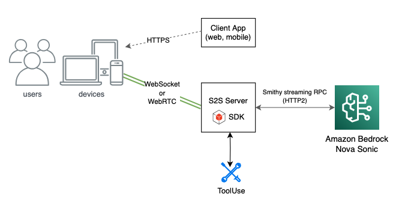

# **Amazon Nova S2S full stack application for voice assistance with Strands Agents integration**

_**Technology stack**: Python, Node.js, React, `http.server`, `boto3`, Strands Agents SDK, Amazon Nova Sonic & Lite_ \
_**AWS services**: IAM, EC2/VPC, ECS Fargate, ECR, CloudWatch, Amazon Bedrock_ \
_**IaC framework**: AWS Cloud Development Kit_

## Attribution

This project is a fork of an official [Amazon Nova S2S workshop](https://github.com/tsanti/amazon-nova-samples/tree/main/speech-to-speech/workshops) but has been heavily modified and is maintained independently.

## Abstract

The following application demonstrates an implementation of the Amazon Nova Sonic model for voice assistance with additional features for using tools via Strands Agents integration. The voice assistant comes by default with two tools for web search using Tavily and for Bedrock Knowledge Base RAG, which are natively implemented through the `strands-agents-tools` package, while the programmatic implementation of additional tools has been made easier given the monolithic architecture of the repository. 

The UI components had been developed using React and the agent flow is integrated through WebSocket speech-to-speech (S2S) sessions, also having midspeech interruption enabled. The backend entrypoint can be executed locally for development or testing, or the server can be deployed via CDK and hosted using ECS Fargate, with Dockerized code pushed into an ECR repository, ideal for production mode.

## Deployment

### Requirements

* Python version 3.12 or later

* AWS CLI profile with administrator-like permissions on the services listed above

* AWS access to the Amazon Nova Lite (`amazon.nova-lite-v1:0`) and Amazon Nova Sonic (`amazon.nova-sonic-v1:0`) models

* Node.js 20.x or later installed (check current [Node.js versions supported by AWS CDK](https://docs.aws.amazon.com/cdk/v2/guide/node-versions.html))

* AWS CDK v2 `npm` package installed

* CDK bootstrapped in the AWS account, done by running:
    ``` bash
    cdk bootstrap [--profile PROFILE_NAME]
    ```

#

### Guideline

Before deploying the project, dependencies have to be installed globally or locally in a virtual environment placed in the root directory which has to be activated. To manage the stack without changing internal project settings, run CDK-related commands inside the `src/backend/` directory which contains the already configured CDK source files. Example for Unix-based shells:

``` bash
python -m venv .venv
source .venv/bin/activate # PowerShell command: .venv/Scripts/activate
pip install -r src/backend/requirements.txt
```

Three Bash scripts have been implemented to easily perform essential operations over the stack and project, with the ability to set a custom AWS CLI profile. First, head to the root folder `scripts`.

Deploy the project to the cloud and push the Docker image to ECR by running:

``` bash
./deploy.sh
```

To push any updates in the backend code to the ECR repository run:

``` bash
./build.sh
```

Delete the project and all of its AWS resources by running:

``` bash
./destroy.sh
```

Additionally, include the `-p PROFILE_NAME` flag in case of having configured a specific AWS CLI profile.

## Architecture



#

The CDK stack provisions the following resources:

* An ECR repository for hosting the Dockerized WebSocket server image
* A VPC with two public subnets across two availability zones and no NAT gateways
* A security group allowing inbound TCP traffic on ports 8081 (WebSocket) and 8082 (health check)
* An ECS Fargate cluster with a service initially set to 0 desired tasks, to be scaled up after the Docker image is pushed to ECR
* An IAM task role with permissions for Amazon Bedrock
* A CloudWatch Log Group for container logging

The service is deployed with `assignPublicIp` enabled and runs on 1 vCPU / 2 GB memory Fargate tasks. A container health check is configured against the `http://localhost:8082/health` endpoint.

The application supports an optional [Strands Agent](https://strandsagents.com/) that orchestrates external tool calls during a voice conversation. When enabled via the `--enable-strands` flag, the WebSocket server initializes a Strands Agent running on Amazon Nova Lite with two native tools implemented in the integration file (`strands_agent.py`):

* `tavily` for real-time web search queries (e.g. current events, locations, facts)
* `retrieve` for domain-specific RAG queries against a configured Bedrock Knowledge Base

The tool definitions are declared in the S2S session configuration (`config.json`) and are sent to Nova Sonic as part of the prompt setup. When Nova Sonic determines that a tool should be invoked, it emits a `toolUse` event which the session manager intercepts, delegates to the Strands Agent for reasoning and execution, and returns the result back into the S2S stream as a `toolResult` event.

#

### Configuration

Additional tools can be added programmatically by extending the `tools` list in `src/backend/websocket/integration/strands_agent.py` and registering the corresponding tool specification in the `DEFAULT_TOOL_CONFIG` section of `src/frontend/src/agent/config.json`, which should be reflected in the local backend counterpart (`src/backend/websocket/config.json`) which is automatically copied into the ECR repository through the Dockerfile.

Other voice assistant behavior properties can be customized through the `config.json` file:

* **Inference configuration**: `maxTokens`, `topP`, and `temperature` for the Nova Sonic model
* **System prompt**: The default instructions given to the assistant for conversation behavior
* **Audio input/output configuration**: Media type, sample rate, bit depth, channel count, and voice ID (review `configVoices.js`)
* **Tool configuration**: The list of tools exposed to Nova Sonic during the S2S session

The frontend also provides a settings modal accessible during a session, allowing runtime adjustments to the voice ID, system prompt, and tool configuration without restarting the server.

## Development

To run the application locally without deploying to AWS, both the Python WebSocket server and the React frontend need to be started independently.

#

### Backend

1. Install dependencies globally or preferably in a virtual environment at `src/backend`

2. Set the required environment variables for AWS authentication:

    ``` bash
    export AWS_ACCESS_KEY_ID="YOUR_AWS_ACCESS_KEY_ID"
    export AWS_SECRET_ACCESS_KEY="YOUR_AWS_SECRET_ACCESS_KEY"
    export AWS_DEFAULT_REGION="us-east-1"
    ```

3. The WebSocket host and port are optional. If not specified, the server defaults to `localhost:8081`:

    ``` bash
    export HOST="localhost"
    export WS_PORT=8081
    ```

    The health check port is optional and intended for container deployments (ECS/EKS). If not set, the HTTP health check endpoint will not start:

    ``` bash
    export HEALTH_PORT=8082
    ```

4. Start the server:

    ``` bash
    python server.py
    ```

    To enable the Strands Agent integration for tool usage (Tavily web search and Bedrock Knowledge Base retrieval), pass the `--enable-strands` flag:

    ``` bash
    python server.py --enable-strands
    ```

    For the Strands Agent tools to work, the following environment variables must also be set:

    ``` bash
    export TAVILY_API_KEY="YOUR_TAVILY_API_KEY"
    export KNOWLEDGE_BASE_ID="YOUR_BEDROCK_KNOWLEDGE_BASE_ID"
    ```

    Debug mode can be enabled with the `--debug` flag for verbose logging.

> [!NOTE]
> Keep the WebSocket server running, then launch the React frontend in a separate terminal.

#

### Frontend

1. Navigate to the frontend directory and install dependencies:

    ``` bash
    cd src/frontend
    npm install
    ```

2. Set the WebSocket URL environment variable to the ECS public IP WebSocket address if deployed. If not provided, the application defaults to `ws://localhost:8081`:

    ``` bash
    export REACT_APP_WEBSOCKET_URL="YOUR_WEBSOCKET_URL"
    ```

3. Start the development server:

    ``` bash
    npm start
    ```

When using Chrome, ensure the site's sound setting is set to Allow if there is no audio output.

> [!WARNING]
> This UI is intended for demonstration purposes and may encounter state management issues after frequent conversation start/stop actions. Refreshing the page can help resolve the issue.